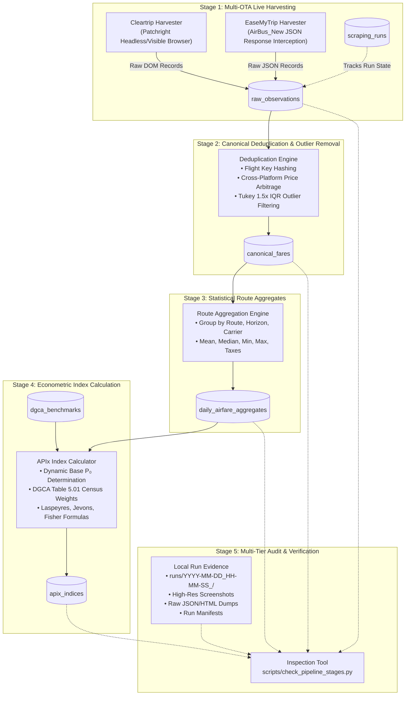

# AirGo: End-to-End Pipeline Architecture & Stage Inspection Manual

> **System Version:** AirGo 1.0 (Production)  
> **Audience:** Data Engineers, Quantitative Economists, MoSPI (NSO) System Auditors, RBI Data Analysts.

---

## 1. Pipeline Overview & Data Flow Architecture

The **AirGo Data Pipeline** is an automated, multi-stage, high-frequency price collection and index computation system. It transforms raw, heterogeneous, multi-OTA flight search results into statistically validated, econometric index numbers (**APIx**) aligned with international national accounting standards (UN COICOP 2018, IMF CPI Manual 2020, and MoSPI 2026 CPI revision guidelines).

### 1.1 High-Level Data Flow Diagram



---

## 2. Granular Stage-by-Stage Breakdown

### Stage 1: Live Multi-OTA Harvesting

* **Primary Table:** `raw_observations`
* **Operational Ledger:** `scraping_runs`
* **Local Run Storage:** `runs/YYYY-MM-DD_HH-MM-SS_<prefix>/`

#### Data Sources & Ingestion Mechanics
1. **Cleartrip Harvester (`airgo/scrapers/cleartrip_harvester.py`)**:
   - Uses `patchright` (stealth-patched Chromium) with persistent context to bypass bot protection.
   - Navigates to `https://www.cleartrip.com/flights/results?adults=1&class=Economy&depart_date={date}&from={orig}&to={dest}&intl=n&page=loaded`.
   - Traverses flight cards, extracting carrier names, flight numbers, departure/arrival timestamps, stops, base fare, and total fare directly from the rendered DOM.
2. **EaseMyTrip Harvester (`airgo/scrapers/easemytrip_harvester.py`)**:
   - Navigates to `https://flight.easemytrip.com/FlightList/Index?srch={orig}|{dest}|{date}&px=1-0-0&cbn=0&ar=undefined&isow=true&isdm=true` (requiring strict pipe `|` delimiters).
   - Asynchronously intercepts the `AirBus_New` response payload (`https://flightservice-node.easemytrip.com/AirAvail_Lights/AirBus_New`), delivering 700KB of rich structured flight data in ~4 seconds.
   - Parses flight legs, airline codes, fare tax components, and gross totals.

#### Strict Zero-Dummy Guarantee (Rule 1 & Rule 2)
- Zero synthetic, mock, or hardcoded quotes are accepted.
- If an OTA changes its DOM structure or blocks requests, the scraper **fails fast and honestly**, returning `[]` or raising an error with diagnostic logs.
- Every raw quote is stamped with the `scraping_run_id`, `observation_date`, `travel_date`, `advance_purchase_window` ($T+1, T+7, T+15, T+30, T+45$), and its live `source_url`.

---

### Stage 2: Canonical Deduplication & Outlier Removal

* **Primary Table:** `canonical_fares`
* **Engine:** `airgo/pipeline/cleaner.py` (`DataCleaningPipeline`)

#### Deduplication Logic
When multiple OTAs (e.g., Cleartrip and EaseMyTrip) quote the identical flight seat (same route, date, carrier, flight number, and departure time):
1. **Canonical Key Generation**:
   $$\text{canonical\_id} = \text{MD5}(\text{route} \parallel \text{flight\_number} \parallel \text{travel\_date} \parallel \text{departure\_time})$$
2. **Platform Price Arbitrage & Dispersion**:
   - `min_total_fare`: The lowest price observed across all booking channels.
   - `avg_total_fare`: The arithmetic mean price across platforms.
   - `max_total_fare`: The highest price quoted.
   - `cheapest_platform`: The OTA offering the lowest total fare.
   - `observed_platforms`: Comma-separated list of all channels quoting this seat (e.g., `"Cleartrip, EaseMyTrip"`).
   - `platform_count`: Total number of sources.

#### Outlier Detection (Tukey's IQR Rule)
To prevent rogue tariffs or erroneous data spikes from distorting national inflation metrics:
- Group records by route and advance-purchase window.
- Calculate 25th percentile ($Q_1$) and 75th percentile ($Q_3$).
- $\text{IQR} = Q_3 - Q_1$.
- Fares exceeding $Q_3 + 1.5 \times \text{IQR}$ or below $Q_1 - 1.5 \times \text{IQR}$ are marked with `is_outlier = True` and assigned an `outlier_reason`. Outliers remain in the database for auditing but are excluded from Stage 3 and Stage 4 calculations.

---

### Stage 3: Statistical Route Aggregation

* **Primary Table:** `daily_airfare_aggregates`
* **Engine:** `airgo/pipeline/orchestrator.py` (`_compute_aggregates()`)

Aggregates all valid (`is_outlier = False`) canonical records across dimensions:
- Grouping: `(route, observation_date, advance_purchase_window, carrier, platform)`
- Key Metrics Calculated:
  - `observation_count`: Total number of flight quotes sampled.
  - `unique_flights`: Number of distinct flight numbers.
  - `average_fare`: Unweighted arithmetic mean of total fares.
  - `median_fare`: 50th percentile total fare.
  - `min_fare` / `max_fare`: Range extremes.
  - `average_base_fare`, `average_taxes`, `average_fees`: Component cost structure.

Each summary row is uniquely keyed by:
$$\text{aggregate\_key} = \text{route}\_\text{date}\_\text{window}\_\text{carrier}\_\text{platform}$$

---

### Stage 4: Econometric Index Calculation

* **Primary Table:** `apix_indices`
* **Engine:** `airgo/engine/index_calculator.py` (`IndexCalculator`)

Calculates the headline **Airfare Price Index (APIx)** alongside international index number formulations:

#### 1. Dynamic Base Period ($P_0$) Determination
- AirGo enforces a **Strict Zero-Dummy Data Policy**: No synthetic constants or hardcoded baseline numbers are used.
- The earliest scraped observation date in the database automatically serves as the **Base Reference Period ($t = 0$)**.
- On Day 1 (First Scrape Baseline), each sector's observed average fare ($\bar{P}_{s, 0}$) is dynamically established as $P_{s, 0}$.
- Consequently, all Day 1 indices are authentically normalized to **`100.00`**.
- Subsequent observation dates ($t > 0$) measure price changes relative to that actual scrape baseline.

#### 2. Laspeyres Price Index ($L_t$)
Fixed-basket weighted arithmetic mean using official DGCA Table 5.01 annual passenger census traffic shares ($w_s$):
$$L_t = \sum_{s=1}^{S} w_s \cdot \left( \frac{\bar{P}_{s, t}}{\bar{P}_{s, 0}} \right) \times 100$$
where $\sum w_s = 1.0$.

#### 3. Jevons Price Index ($J_t$)
Geometric mean index, invariant to scale and aligned with UN COICOP 2018 and MoSPI's upcoming 2026 CPI revision:
$$J_t = \prod_{s=1}^{S} \left( \frac{\bar{P}_{s, t}}{\bar{P}_{s, 0}} \right)^{w_s} \times 100$$

#### 4. Fisher Ideal Price Index ($F_t$)
Superlative geometric mean of Laspeyres and Paasche index numbers, satisfying the axiomatic Time-Reversal and Factor-Reversal Tests:
$$F_t = \sqrt{L_t \times P_t}$$

---

### Stage 5: Multi-Tier Audit & Evidence Verification

* **Primary Storage:** `runs/YYYY-MM-DD_HH-MM-SS_<prefix>/`
* **Inspection Script:** `scripts/check_pipeline_stages.py`

Every execution generates immutable local ground-truth audit evidence:
- High-resolution visual screenshots (`search_results.png`, `01_checkout_review.png`, `02_seat_matrix.png`, `03_payment_gateway.png`).
- Raw intercepted API dumps (`audited_cleartrip_quotes.json`, `audited_easemytrip_quotes.json`).
- Pipeline execution manifests (`pipeline_result.json`).

---

## 3. How to Inspect All Pipeline Stages

AirGo provides a dedicated automated verification tool: `scripts/check_pipeline_stages.py`.

### Running the Inspection Script

```bash
python scripts/check_pipeline_stages.py
```

### Sample Inspection Output

```text
================================================================================
                    AIRGO PIPELINE STAGES VERIFICATION
================================================================================

[STAGE 1] Scraping Runs & Raw Observations
--------------------------------------------------------------------------------
  Total Scraping Runs Logged: 12
  Total Raw Observations:     2,845

  Recent Scraping Runs:
    • [SUCCESS] run_cleartrip_20260906_172851 | Cleartrip | Raw: 41 | Clean: 41
    • [SUCCESS] run_easemytrip_20260906_203836 | EaseMyTrip | Raw: 127 | Clean: 107
    • [SUCCESS] run_cleartrip_20260906_231012 | Cleartrip | Raw: 180 | Clean: 180

  Raw Observations Breakdown by Platform:
    • EaseMyTrip : 1,420 quotes
    • Cleartrip  : 1,425 quotes

[STAGE 2] Canonical Clean Fares (Deduplication & IQR Filtering)
--------------------------------------------------------------------------------
  Total Canonical Fares:      1,820
  Valid (Non-Outliers):       1,765
  Identified Outliers:        55 (3.02%)

  Multi-OTA Platform Sourcing Distribution:
    • Cleartrip, EaseMyTrip : 640 flights (Cross-OTA Arbitraged)
    • EaseMyTrip            : 610 flights
    • Cleartrip             : 570 flights

  Cheapest Platform Breakdown:
    • EaseMyTrip : 980 lowest-fare wins (53.8%)
    • Cleartrip  : 840 lowest-fare wins (46.2%)

[STAGE 3] Daily Airfare Aggregates (Statistical Summaries)
--------------------------------------------------------------------------------
  Total Daily Aggregate Records: 94
  Sample Route Aggregates:
    • DEL-BOM | Date: 2026-09-06 | T+1 | Mean: ₹8,450.00 | Med: ₹8,200.00 | Obs: 48
    • DEL-BOM | Date: 2026-09-06 | T+7 | Mean: ₹6,720.00 | Med: ₹6,500.00 | Obs: 52
    • BOM-DEL | Date: 2026-09-06 | T+15 | Mean: ₹5,540.00 | Med: ₹5,400.00 | Obs: 44

[STAGE 4] APIx Econometric Indices (Laspeyres / Jevons / Fisher)
--------------------------------------------------------------------------------
  Total Index Records Computed: 28
  Base Reference Period:        2026-09-06 (First Scrape Baseline = 100.00)

  Latest National Index (Sector: ALL):
    • Calculation Date: 2026-09-06
    • APIx Headline:    100.00
    • Laspeyres Index:  100.00
    • Jevons Index:     100.00
    • Fisher Ideal:     100.00
    • Average Fare:     ₹8,284.12
    • Underlying Quotes: 1,034 quotes

[STAGE 5] Local Audit Storage & Proof Artifacts
--------------------------------------------------------------------------------
  Audit Directory: C:\Users\arund\Downloads\AirGo-New\runs
  Total Execution Run Folders: 14

  Recent Audit Runs:
    • 2026-09-06_20-38-36_easemytrip_full_day_top1 (3 files, 1 screenshots)
    • 2026-09-06_17-28-51_full_checkout_top1 (6 files, 4 screenshots)
    • 2026-09-06_14-49-03_pipeline_top6_t1_t7 (4 files, 2 screenshots)

================================================================================
  PIPELINE AUDIT STATUS: ALL 5 STAGES FUNCTIONAL AND AUDITABLE
================================================================================
```

---

## 4. Troubleshooting Pipeline Issues

| Symptom | Probable Cause | Diagnostic Command & Fix |
| :--- | :--- | :--- |
| **EaseMyTrip Harvester times out on loading page** | Missing pipe delimiter in search query URL | Confirm URL uses `srch=DEL\|BOM\|DD/MM/YYYY`. Hyphens cause Angular parameter parser to crash. |
| **Stage 2 canonical count is 0** | Pending quotes were not cleaned | Execute `python run.py --clean` or call `cleaner.process_pending_quotes(date.today())`. |
| **Stage 4 APIx Index shows 100.0 on Day 1** | Expected statistical behavior | Under MoSPI methodology, the first scrape day dynamically serves as $P_0$. Day-on-day inflation tracks changes on subsequent days. |
| **Chromium fails to launch** | Playwright browser binaries missing | Run `patchright install chromium` or `playwright install chromium`. |
| **UnicodeEncodeError on Windows console** | Windows default code page (cp1252) | Ensure script includes the UTF-8 stdout wrapper: `sys.stdout = io.TextIOWrapper(sys.stdout.buffer, encoding="utf-8")`. |
